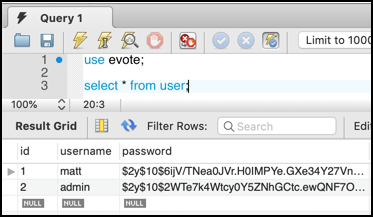

# evote-movie-2020-15-hashed-passwords

We should not be storing plain text passwords in the DB. So let's fix that.



- in the `User` class we need to add in the use of the `password_hash(...)` function, so it is a hashed password stored in the object (and so the DB) rather than the plain text password:

    ```php
    public function setPassword($password)
    {
        $hashedPassword = password_hash($password, PASSWORD_DEFAULT);
        $this->password = $hashedPassword;
    }
    ```

- when we run our command line migration and fixtures script for the DB users we'll now see how a long hash is stored in the DB for each user password:
    
    ```bash
    php db/migrateAndLoadUserFixtures.php 
    --------------- DatabaseTableRepository->createTable() ----------------
    NOTE:: Looking for a constant CREATE_TABLE_SQL defined in the entity class associated with this repository
    -----------------------------------------------------------------------
    <pre>db/migrateAndLoadUserFixtures.php:33:
    array(2) {
      [0] =>
      class Tudublin\User#8 (3) {
        private $id =>
        string(1) "1"
        private $username =>
        string(4) "matt"
        private $password =>
        string(60) "$2y$10$6ijV/TNea0JVr.H0IMPYe.GXe34Y27Vnez.NZV399vJ6Z7EY13NFC"
      }
      [1] =>
      class Tudublin\User#9 (3) {
        private $id =>
        string(1) "2"
        private $username =>
        string(5) "admin"
        private $password =>
        string(60) "$2y$10$2WTe7k4Wtcy0Y5ZNhGCtc.ewQNF7OfSuIpZQ11FuoqPcT8yJDvwrK"
      }
    }
    ```

- finally, we need to test the user subnmitted login-form password with out retreived DB hashed password, in `LoginController` method `checkCredentials(...)`. We do this with PHP function `passsword_verify(...)`:

    ```php
    public function checkCredentials($username, $password)
    {
        $userRepository = new UserRepository();
        $user = $userRepository->getUserByUserName($username);
    
        if($user) {
            $passwordFromDatabase = $user->getPassword();
            if(password_verify($password, $passwordFromDatabase)){
                return true;
            }
        }
    
        return false;
    }
    ```

